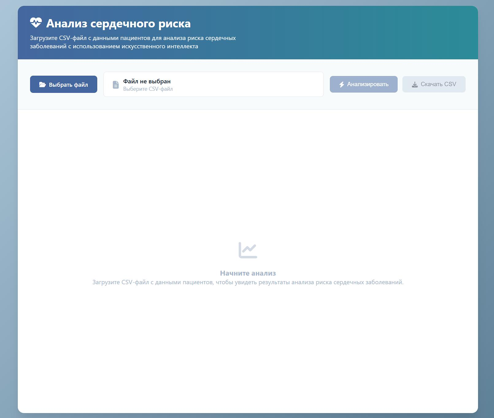
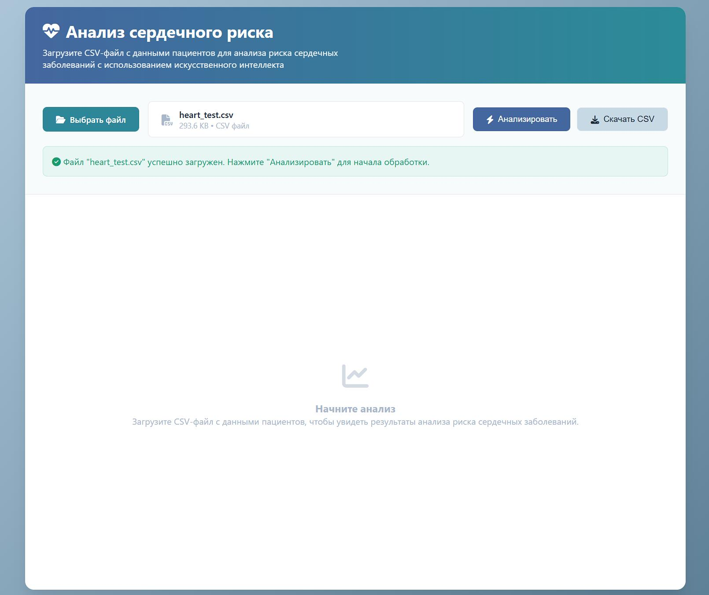
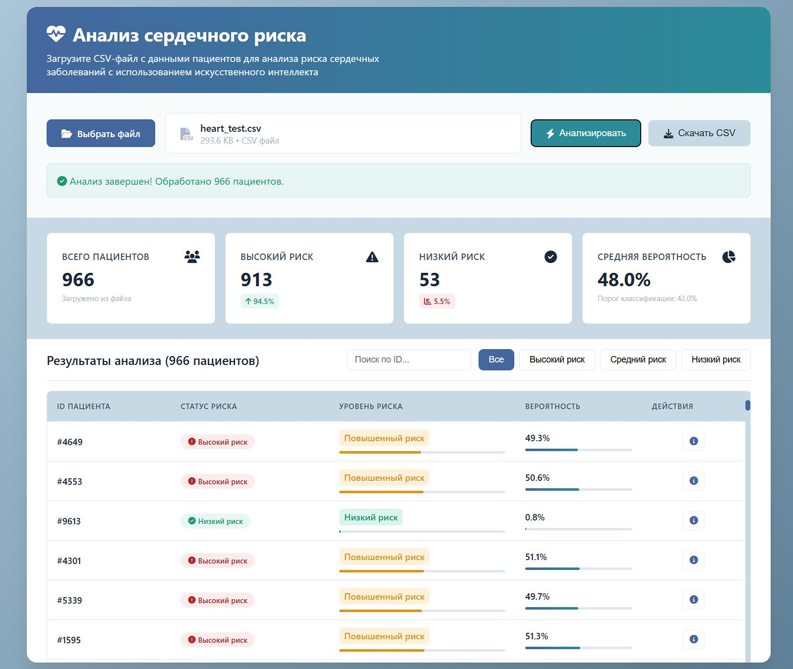
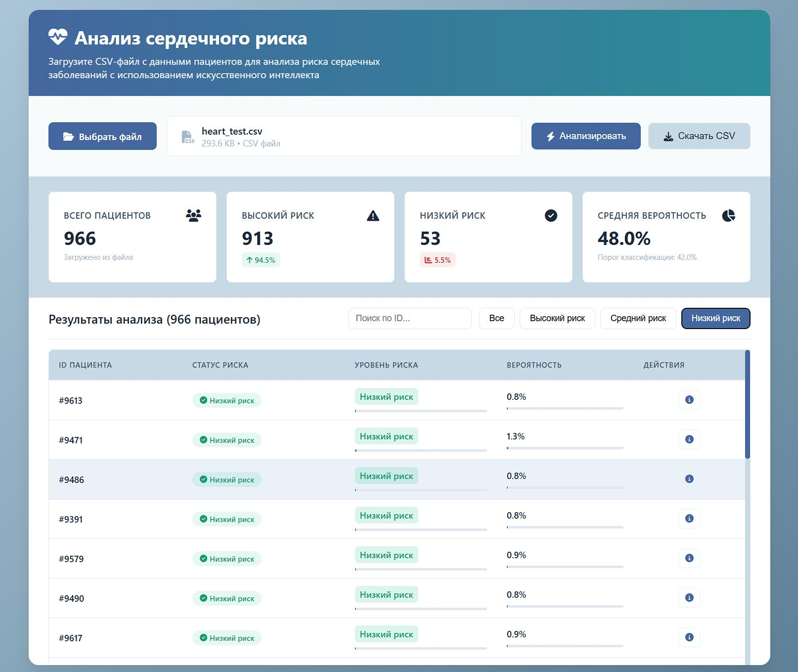
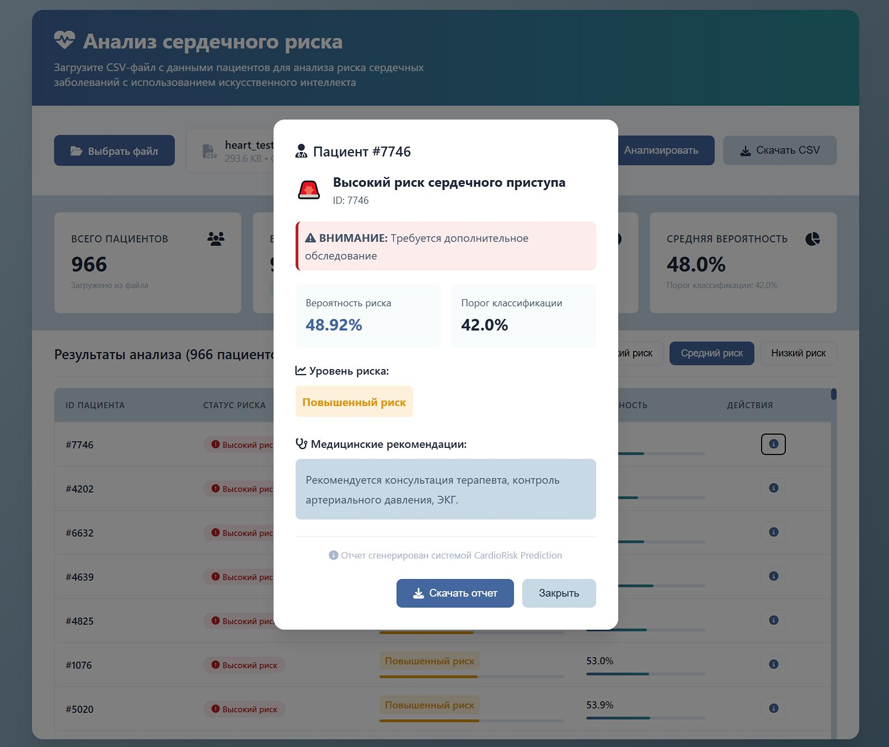
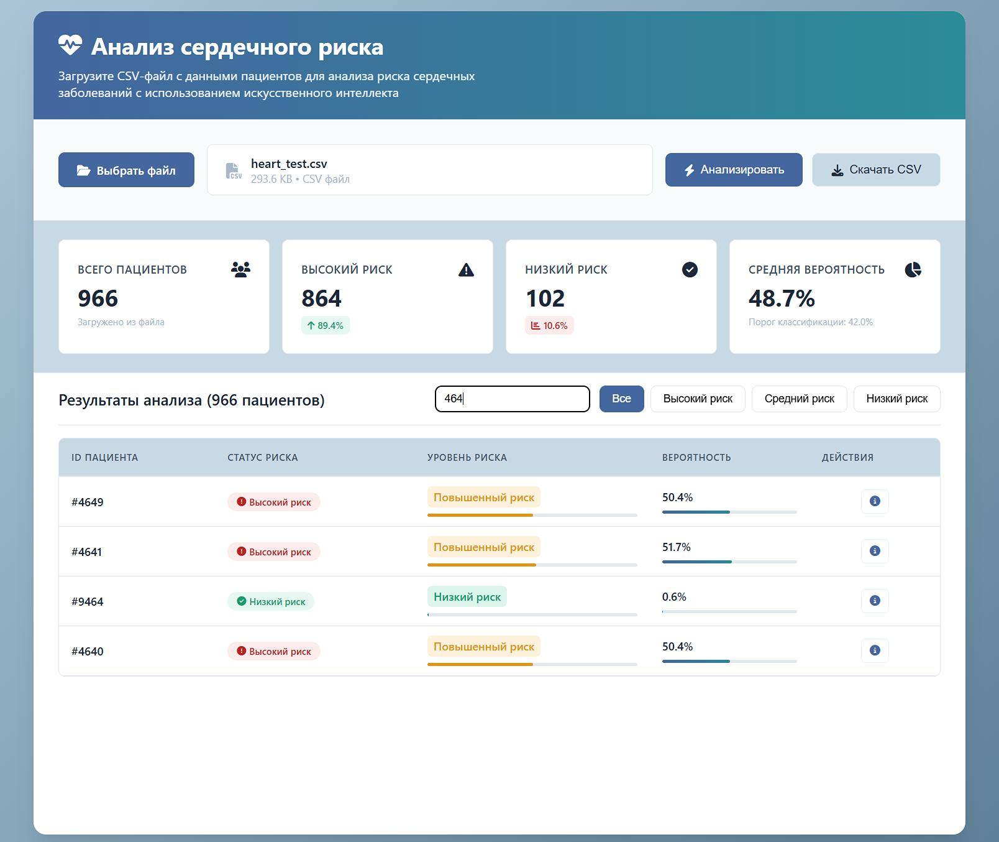
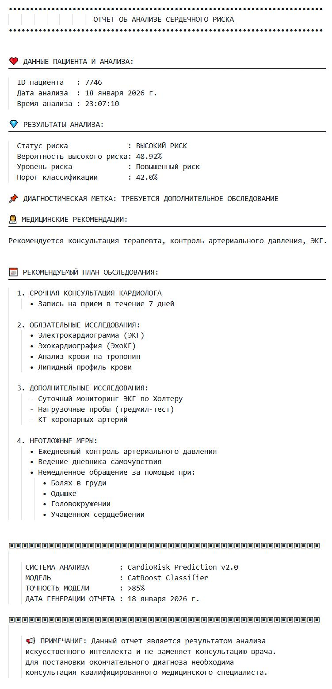

# Предсказание риска сердечного приступа

Интеллектуальный сервис для раннего выявления пациентов с высоким риском сердечного приступа.  
Создан с фокусом на **клиническую применимость**, **интерпретируемость** и **ответственность**.


## Этапы разработки

- **Глубокий EDA в `risk_of_heart_attack.ipynb`**  
  Анализ данных, обработка систематических пропусков, кодирование признака `Gender`, выявление аномалий (например, некорректное давление), оценка качества биомаркеров

- **Отбор признаков и оптимизация под медицинский контекст**  
  Финальная модель использует **15 клинически значимых признаков**, исключая диагностические маркеры (`CK-MB`, `Troponin`), недоступные до события

- **Настройка порога принятия решения**  
  Порог классификации **0.42** выбран для максимизации **Recall (чувствительности)** - критически важного показателя в кардиологии

- **Финальные метрики на валидации**  
  - **Recall (класс 1 - высокий риск): 0.947**  
    - Модель находит **95% пациентов из группы высокого риска**  
  - **F1-score (класс 1): 0.528**  
    - Оптимальный баланс между чувствительностью и точностью при текущем дисбалансе классов

- **Экспорт production-пайплайна**  
  Полностью воспроизводимый пайплайн: медианный имьютинг + CatBoost-модель + список признаков + оптимальный порог

- **FastAPI-сервис для интеграции**  
  Простой эндпоинт `/predict` принимает CSV-файл и возвращает структурированные предсказания

- **Совместимость**  
  Формат выходных данных полностью совместим с тестовым скриптом `test.py`


## 📁 Структура проекта

```bash
проект/
├── app.py                         # FastAPI-сервер с эндпоинтами /predict и /health
├── static/
│   └── index.html                 # Человеко-ориентированный веб-интерфейс для загрузки и анализа
├── models/                        # Production-артефакты модели
│   ├── heart_risk_model.cbm       # Бинарная модель CatBoost
│   ├── model_features.json        # Список 15 используемых признаков
│   ├── preprocessing_config.json  # Конфигурация препроцессинга
│   └── optimal_threshold.json     # Оптимальный порог (0.42)
├── src/                           # Исходный код модулей
│   └── preprocessing/
│       └── data_preprocessor.py   # Логика очистки и подготовки данных
├── requirements.txt               # Зависимости для pip
├── environment.yml                # Зависимости для Conda
└── README.md                      # Документация проекта
```


> 💡 **Этический принцип**: Модель предназначена **не для постановки диагноза**, а для выявления пациентов, требующих **срочной консультации врача**


## 🚀 Как запустить проект

### 1. Установите зависимости

Проект поддерживает два способа установки зависимостей - через `pip` или `conda`.

#### Вариант A: через pip (рекомендуется)

```bash
# Создайте и активируйте виртуальное окружение
python -m venv .venv
source .venv/bin/activate        # Linux/macOS
# ИЛИ
.venv\Scripts\activate          # Windows

# Обновите pip и установите зависимости
pip install --upgrade pip
pip install -r requirements.txt
```

#### Вариант B: через conda

```bash
# Создайте окружение из environment.yml
conda env create -f environment.yml

# Активируйте окружение
conda activate heart_risk_api
```


### 2. Подготовьте модель

Убедитесь, что папка `models/` содержит следующие файлы:

- `heart_risk_model.cbm` - обученная модель CatBoost  
- `model_features.json` - список признаков, используемых моделью  
- `optimal_threshold.json` - порог классификации (например, `{"threshold": 0.42}`)  
- `preprocessing_config.json` - конфигурация препроцессора (используется в `src/preprocessing/data_preprocessor.py`)

> ⚠️ Если этих файлов нет, сначала выполните обучение модели в `risk_of_heart_attack.ipynb` и сохраните артефакты в папку `models/`
> 

### 3. Запустите сервер

```bash
python app.py
```

После запуска вы увидите информацию вроде:

```bash
━━━━━━━━━━━━━━━━━━━━━━━━━━━━━━━━━━━━━━━━━━━━━━━━━━━━━━━━━━━━━━━━━━━━━━━
🚀 CardioRisk Prediction System
━━━━━━━━━━━━━━━━━━━━━━━━━━━━━━━━━━━━━━━━━━━━━━━━━━━━━━━━━━━━━━━━━━━━━━━
📊 Загружено признаков : 15
⚖️ Порог классификации : 0.42
🤖 Модель загружена    : Да
🔄 Препроцессор        : Да
━━━━━━━━━━━━━━━━━━━━━━━━━━━━━━━━━━━━━━━━━━━━━━━━━━━━━━━━━━━━━━━━━━━━━━━
🌐 Веб-интерфейс       : http://localhost:8000
📖 Документация API    : http://localhost:8000/api/docs
📊 Проверка состояния  : http://localhost:8000/api/health
━━━━━━━━━━━━━━━━━━━━━━━━━━━━━━━━━━━━━━━━━━━━━━━━━━━━━━━━━━━━━━━━━━━━━━━
```


### 4. Используйте приложение

#### 🖥️ Веб-интерфейс (рекомендуемый способ для тестирования)

1. Откройте в браузере: [http://localhost:8000](http://localhost:8000)
2. Нажмите **«Выбрать файл»** и загрузите CSV-файл с данными пациентов (обязательно должна быть колонка `id`)
3. Нажмите **«Анализировать»**
4. Результаты отобразятся в таблице. Вы можете:
   - Фильтровать по уровню риска
   - Искать по ID пациента
   - Скачать результаты в формате CSV

#### 📡 API

- **POST `/predict`** - загрузите CSV-файл и получите JSON с детализированными предсказаниями (вероятность, уровень риска, рекомендации)
- **POST `/predict/csv`** - загрузите CSV-файл и получите ответ в формате `submission.csv` (только `id` и `prediction`)
- **GET `/api/health`** - проверка работоспособности сервиса

Пример вызова через `curl`:

```bash
curl -X POST "http://localhost:8000/predict/csv" \
  -H "accept: text/csv" \
  -F "file=@datasets/heart_test.csv" \
  -o submission.**csv**
```


## Скриншоты приложения












